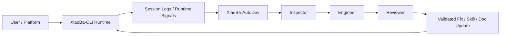

# XiaoBa World

> A repo-aware data flywheel built on top of `XiaoBa Runtime`.

`XiaoBa World` is the world around `XiaoBa Runtime`.
It is not a generic patch bot and not a random monorepo. It is the place where runtime evidence, agent roles, case processing, verification, and world evolution are connected into one engineering loop.

## Vision

Build a world that can:

- observe real runtime behavior
- turn logs into actionable cases
- route work through `Inspector -> Engineer -> Reviewer`
- write validated improvements back into the right runtime and world modules
- accumulate reusable skills, fixtures, and system knowledge over time

## Core Loop



## What Lives Here

| Path | Purpose |
| --- | --- |
| `XiaoBa-CLI/` | The runtime kernel, roles, command system, and local execution layer. It is tracked directly in this repository. |
| `XiaoBa-AutoDev/` | The case platform for logs, artifacts, events, states, and review history. |
| `docs/` | Architecture, PRD, and technical breakdowns for world-level modules. |
| `AGENT_LOOP_XIAOBA_WORLD.md` | End-to-end loop design. |
| `XIAOBA_WORLD_WORLDVIEW.md` | Worldview, philosophy, and product direction. |

## Why `XiaoBa-CLI` Is Included Directly

`XiaoBa-World` intentionally tracks the local `XiaoBa-CLI` source tree directly instead of pointing to the upstream `XiaoBa-CLI` GitHub repository as a submodule.

That keeps world-level development isolated from the original runtime upstream and lets this repository preserve local runtime evolution, experimental roles, and data-flywheel work without polluting another main branch.

## Quick Start

### 1. Clone the repository

```bash
git clone https://github.com/buildsense-ai/XiaoBa-World.git
cd XiaoBa-World
```

### 2. Prepare local config

```bash
cp XiaoBa-AutoDev/.env.example XiaoBa-AutoDev/.env
cp XiaoBa-CLI/.env.example XiaoBa-CLI/.env
```

Fill secrets locally and keep them local.

### 3. Start AutoDev

```bash
cd XiaoBa-AutoDev
python -m uvicorn app.main:app --host 0.0.0.0 --port 8090 --app-dir .
```

### 4. Start Runtime

```bash
cd ../XiaoBa-CLI
npm install
npm run dev -- chat -i
```

## Security and Publish Rules

This repository is configured to avoid leaking local state:

- `.env`, `.env.runtime`, `.env.inspector`, and similar secret-bearing config files are ignored
- local logs, session traces, caches, temp folders, and case data are ignored
- IDE folders and machine-specific artifacts are ignored
- the old nested `XiaoBa-CLI` git metadata is kept only as a local backup and is not published

If you add new local credentials or machine-bound runtime artifacts, update `.gitignore` before pushing.

## Key Documents

- [Agent Loop Design](./AGENT_LOOP_XIAOBA_WORLD.md)
- [Worldview](./XIAOBA_WORLD_WORLDVIEW.md)
- [CatVis Architecture](./docs/CATVIS_ARCHITECTURE.md)
- [CatVis PRD](./docs/CATVIS_PRD.md)
- [CatVis Technical Breakdown](./docs/CATVIS_TECH_BREAKDOWN.md)

## Status

`XiaoBa World` is the coordination layer for a living system:

- `XiaoBa-CLI` evolves the runtime kernel
- `XiaoBa-AutoDev` runs the evidence and case loop
- `XiaoBa-World` defines how the whole system learns, verifies, and improves
